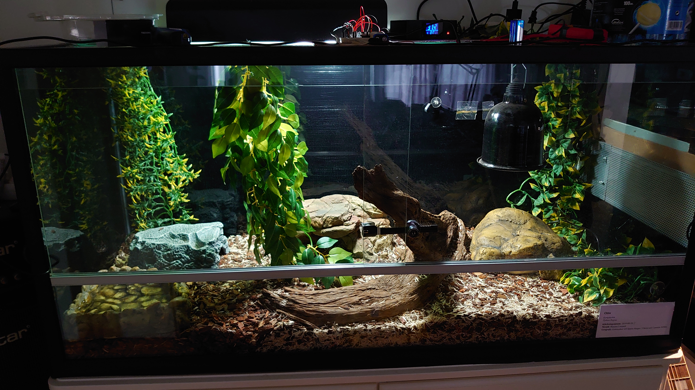
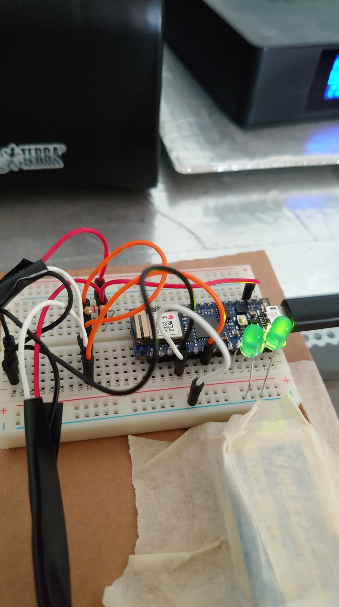
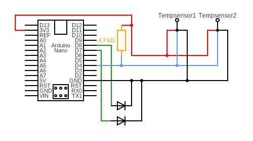

# Arduino Nano 33 IoT Code

Author: Sebastian Åkerblom
Student id: sa224ny

## The idea

I wanted to measure the temperatures in a snake terrarium from both sides as this terrarium has a heatmat and a heatlamp on one side.
It's a glass terrarium which in the winter time leaks a lot of heat so I wanted these measurements to be able to adjust the heat accordingly.

This was managed using the Arduino nano 33 IoT microcontroller and 2x DS18B20 waterproof temperature sensors.

Overview (device on top with the temperature sensor cables going off on left and right):

View of the device from top (I finally opted to use the micro usb cable as the device drained a 9V battery overnight):

## Curcuit

Diagram:

## Installation

- Plug in your Arduino Nano 33 IoT to your computer and start the arduino IDE.
- Add the ArduinoMqttClient, WiFiNINA and OneWire library.
- Go to sketch and edit the according to IoT-Assignment.ino.
- A good practice is to use arduino_secrets like done in this project.
- Upload the sketch to your device.

## Components

- 1x Arduino Nano 33 IoT (Microcontroller)
- 2x DS18B20 (Temperature sensors)
- 1x 4.7k resistor
- 1x Breadboard
- ?x Jumper wires
